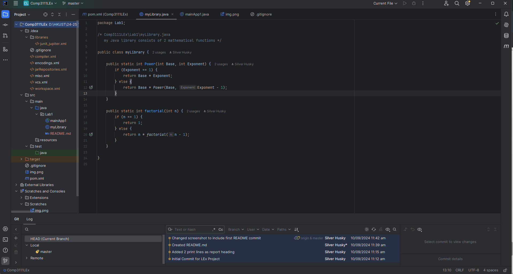

# COMP3111 - Software Engineering

## Lab Exercise Repository

This repo was made on 2024/09/10 during the first lab.

# Labs

## Lab 1

- Configured Maven project in Intellij for Course
- Manual setup of VCS using Git and hosted on GitHub
- Created basic Java classes for tutorial to Intellij

One of the tasks is to include an image in the README.md file.

